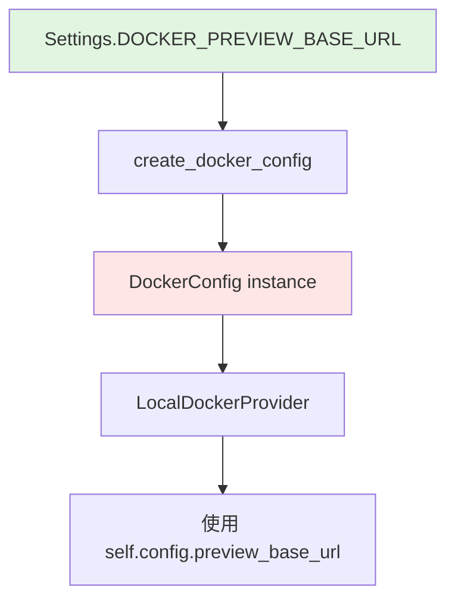
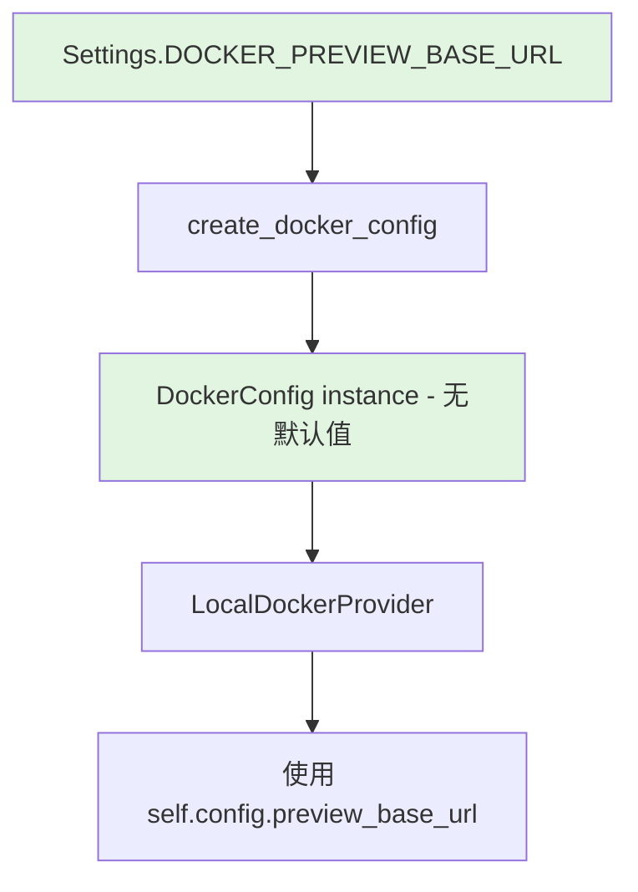

# Design Document

## Overview

本设计旨在消除 `preview_base_url` 配置的重复定义，通过修改 `DockerConfig` 数据类，移除其默认值，强制通过构造函数传入配置。现有的工厂模式已经正确地从 `Settings` 读取配置，因此只需最小化的修改即可实现 DRY 原则。

## Steering Document Alignment

本项目暂无 steering 文档，设计遵循通用最佳实践。

## Code Reuse Analysis

### Existing Components to Leverage

- **`app.core.config.Settings`**: 全局配置类，已经是 `DOCKER_PREVIEW_BASE_URL` 的权威来源
- **`app.services.sandbox_providers.factory.create_docker_config()`**: 工厂函数，已正确地从 `Settings` 读取所有 Docker 配置并创建 `DockerConfig` 实例

### Integration Points

- **`app.services.sandbox_providers.types.DockerConfig`**: 需要移除 `preview_base_url` 的默认值
- **`app.services.sandbox_providers.docker_provider.LocalDockerProvider`**: 通过 `self.config.preview_base_url` 使用配置，无需修改
- **所有测试文件**: 需要确保在创建 `DockerConfig` 时显式传入 `preview_base_url`

## Architecture

### Modular Design Principles

- **Single File Responsibility**: `types.py` 仅负责类型定义，不包含默认配置值
- **Component Isolation**: 配置定义与配置使用分离，`Settings` 定义配置，`DockerConfig` 传递配置
- **Dependency Injection**: 通过构造函数注入配置值，而非硬编码默认值

### Current Flow



### Target Flow



## Components and Interfaces

### Component 1: DockerConfig (types.py)

- **Purpose:** 数据类，定义 Docker 沙箱的运行时配置
- **Current State:** `preview_base_url: str = "http://192.168.1.44"` (有默认值)
- **Target State:** `preview_base_url: str` (无默认值，必填参数)
- **Dependencies:** 无
- **Reuses:** 无

### Component 2: create_docker_config (factory.py)

- **Purpose:** 工厂函数，从 `Settings` 创建配置好的 `DockerConfig` 实例
- **Current Implementation:**
  ```python
  def create_docker_config() -> DockerConfig:
      return DockerConfig(
          image=settings.DOCKER_IMAGE,
          network=settings.DOCKER_NETWORK,
          host=settings.DOCKER_HOST,
          preview_base_url=settings.DOCKER_PREVIEW_BASE_URL,  # 已正确传递
      )
  ```
- **Changes Required:** 无需修改 ✅
- **Dependencies:** `Settings`, `DockerConfig`

### Component 3: LocalDockerProvider (docker_provider.py)

- **Purpose:** Docker 沙箱提供商实现
- **Usage:** 通过 `self.config.preview_base_url` 访问配置 (line 515, 563)
- **Changes Required:** 无需修改 ✅
- **Dependencies:** `DockerConfig`

## Data Models

### DockerConfig (修改后)

```python
@dataclass
class DockerConfig:
    image: str  # 无默认值
    network: str  # 无默认值
    host: str | None  # 保留 None 默认值（可选参数）
    preview_base_url: str  # 移除默认值 "http://192.168.1.44"
    user_home: str = "/home/user"
    openvscode_port: int = 8765
```

## Error Handling

### Error Scenarios

1. **直接实例化 DockerConfig 而未提供 preview_base_url**
   - **Handling:** Python 类型系统会在运行时抛出 `TypeError`
   - **User Impact:** 开发者会立即收到明确的错误信息，提示缺少必需参数
   - **Prevention:** 代码文档应明确说明应使用 `create_docker_config()` 工厂函数

2. **测试代码中创建 DockerConfig**
   - **Handling:** 需要显式传入 `preview_base_url` 参数
   - **User Impact:** 测试代码需要更新以提供必需参数
   - **Prevention:** 在 conftest.py 中提供 fixture 统一创建配置

## Testing Strategy

### Unit Testing

- **DockerConfig 实例化:** 测试缺少 `preview_base_url` 时抛出异常
- **create_docker_config:** 验证从 Settings 正确读取所有配置
- **LocalDockerProvider:** 验证使用传入的配置值

### Integration Testing

- **端到端流程:** 验证从 `.env` → Settings → create_docker_config → DockerConfig → Provider 的完整流程
- **预览链接生成:** 验证 `get_preview_links()` 使用正确的 `preview_base_url`

### Test Files to Update

- `tests/conftest.py` - 更新 fixture 以显式传入 `preview_base_url`
- `tests/unit/test_docker_provider.py` - 更新测试以使用工厂函数或显式传入配置
- `tests/integration/test_sandbox.py` - 验证配置流程

## Implementation Changes Summary

### Files to Modify

1. **`backend/app/services/sandbox_providers/types.py`**
   - 移除 `DockerConfig.preview_base_url` 的默认值
   - 添加文档注释说明该参数为必需

2. **`backend/tests/conftest.py`** (如果存在)
   - 更新 `docker_config` fixture 以显式传入 `preview_base_url`

### Files to Verify (No Changes Expected)

1. **`backend/app/core/config.py`** - 无需修改，已有 `DOCKER_PREVIEW_BASE_URL`
2. **`backend/app/services/sandbox_providers/factory.py`** - 无需修改，已正确传递配置
3. **`backend/app/services/sandbox_providers/docker_provider.py`** - 无需修改

## Backward Compatibility

### Breaking Changes

- **DockerConfig 直接实例化:** 现在必须显式提供 `preview_base_url`
- **Impact:** 任何直接实例化 `DockerConfig()` 而不传参数的代码会失败

### Mitigation

- 项目中应使用 `create_docker_config()` 工厂函数（已在 factory.py:9-15 实现）
- 测试代码需要显式传入参数
- 这是有意的破坏性变更，旨在强制使用单一配置源
