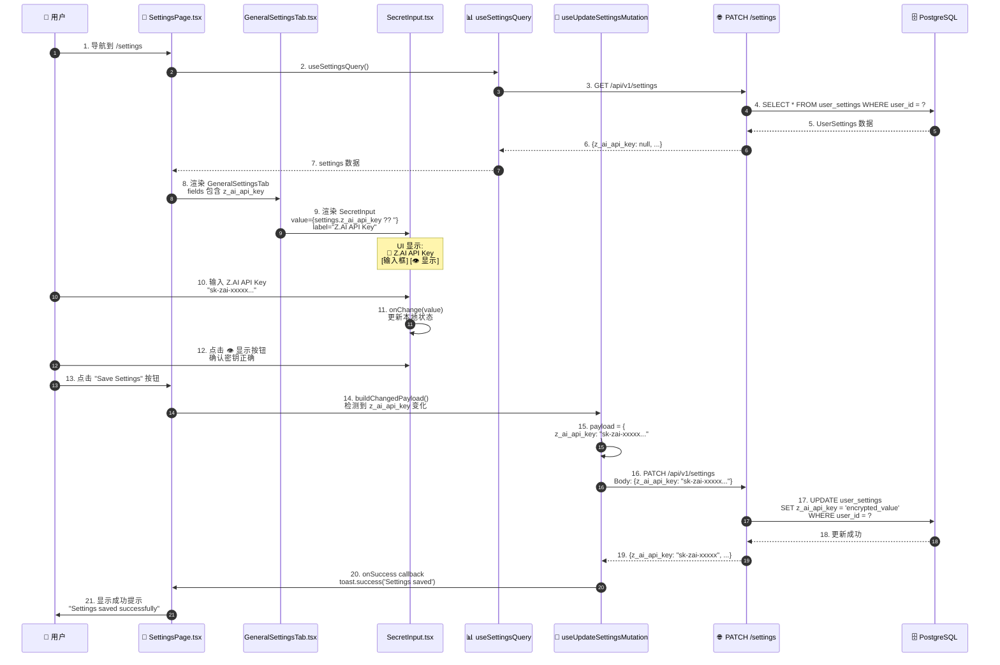
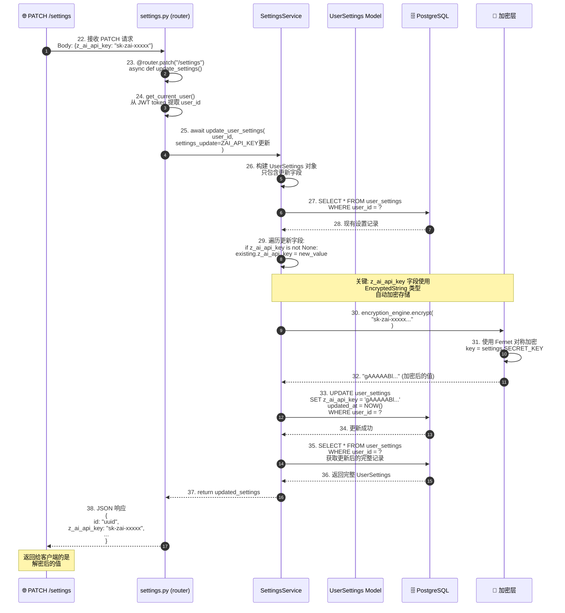
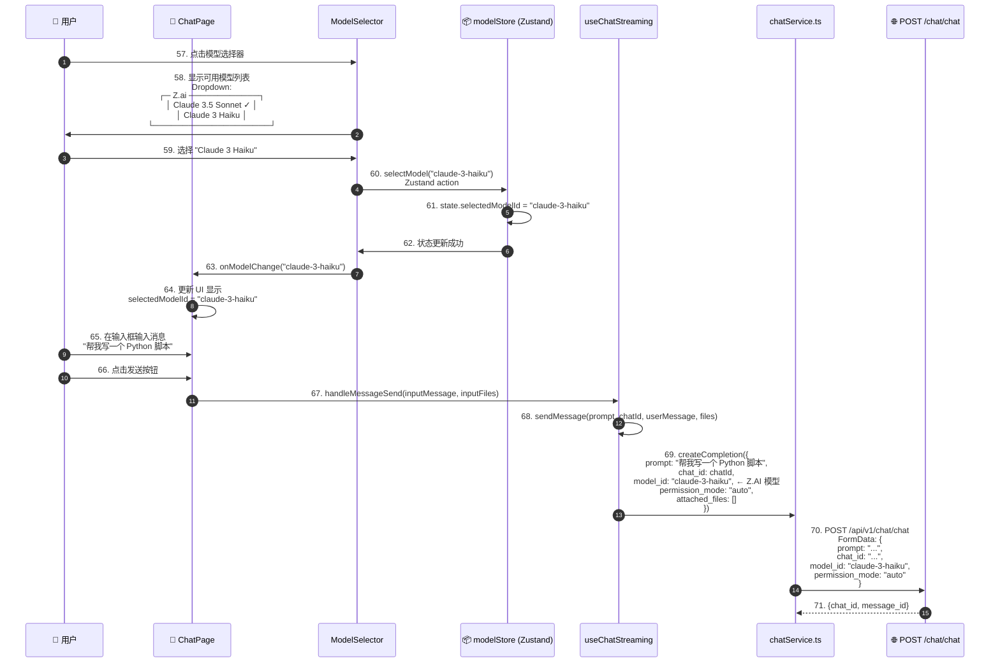
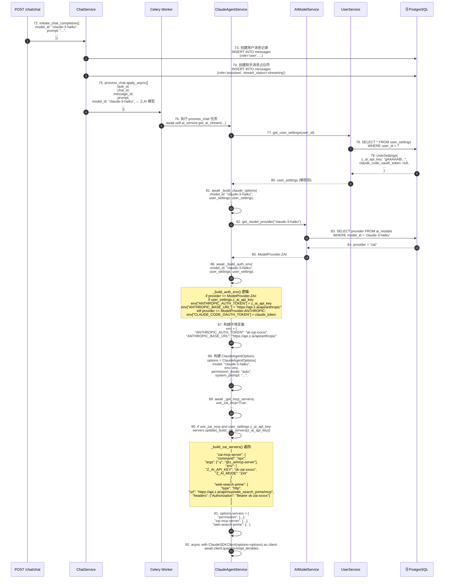
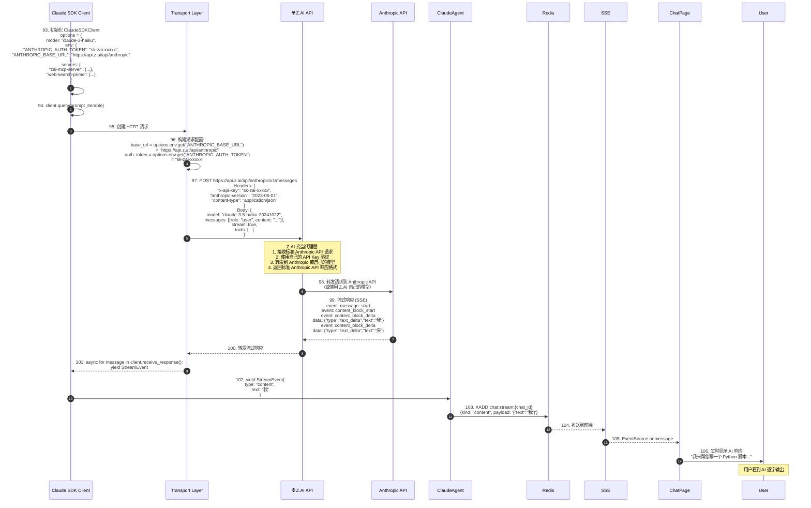
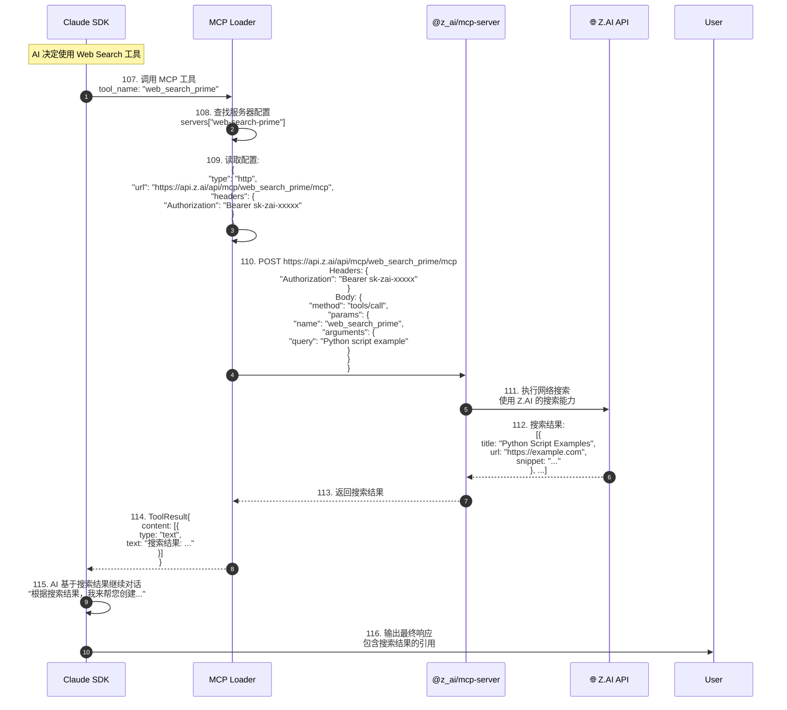

# Z.AI 模型配置与使用完整流程分析

## 📋 目录

1. [流程概述](#流程概述)
2. [配置流程详细分析](#配置流程详细分析)
3. [使用流程详细分析](#使用流程详细分析)
4. [数据流转路径](#数据流转路径)
5. [技术实现细节](#技术实现细节)

---

## 流程概述

本文档详细描述了用户在 Settings 中配置 Z.AI 模型后，系统如何存储、检索和使用 Z.AI 模型信息的完整流程。

### 核心参与者

| 参与者 | 角色 | 技术栈 |
|--------|------|--------|
| **用户** | 配置 Z.AI API Key | 浏览器 |
| **前端 Settings 页面** | 配置 UI | React 19, TypeScript |
| **前端 ModelSelector** | 模型选择器 | React Components |
| **后端 Settings API** | 存储配置 | FastAPI, Python |
| **PostgreSQL** | 持久化存储 | user_settings 表 |
| **AIModelService** | 模型管理服务 | Python |
| **ClaudeAgentService** | AI 对话服务 | Claude SDK |
| **Z.AI API** | 模型推理 | https://api.z.ai |

### 关键数据模型

```typescript
// 前端: UserSettings
interface UserSettings {
  id: string;
  user_id: string;
  z_ai_api_key: string | null;  // Z.AI API 密钥
  claude_code_oauth_token: string | null;
  openrouter_api_key: string | null;
  custom_mcps: MCPConfig[] | null;
  // ... 其他字段
}

// 前端: Model
interface Model {
  model_id: string;       // 例如: "claude-3-5-sonnet-20241022"
  name: string;           // 例如: "Claude 3.5 Sonnet (Z.AI)"
  provider: ModelProvider; // "zai" | "anthropic" | "openrouter"
  is_active: boolean;
  sort_order: number;
}
```

```python
# 后端: UserSettings
class UserSettings(Base):
    __tablename__ = "user_settings"

    id: Mapped[uuid.UUID] = mapped_column(primary_key=True)
    user_id: Mapped[uuid.UUID] = mapped_column(ForeignKey("users.id"))
    z_ai_api_key: Mapped[str | None] = mapped_column(EncryptedString, nullable=True)
    claude_code_oauth_token: Mapped[str | None] = mapped_column(EncryptedString, nullable=True)
    openrouter_api_key: Mapped[str | None] = mapped_column(EncryptedString, nullable=True)
    # ... 其他字段

# 后端: AIModel
class AIModel(Base):
    __tablename__ = "ai_models"

    id: Mapped[int] = mapped_column(primary_key=True)
    model_id: Mapped[str] = mapped_column(unique=True)
    name: Mapped[str]
    provider: Mapped[ModelProvider]  # enum: "zai" | "anthropic" | "openrouter"
    is_active: Mapped[bool]
    sort_order: Mapped[int]
```

---

## 配置流程详细分析

### 阶段一：用户在 Settings 页面配置 Z.AI API Key



**关键代码位置：**
- 前端：`SettingsPage.tsx:284` (revealedFields state)
- 前端：`SettingsPage.tsx:150` (manualUpdateMutation)
- 前端：`GeneralSettingsTab.tsx:62` (z_ai_api_key field)
- 前端：`SecretInput.tsx` (密钥输入组件)

---

### 阶段二：后端处理配置更新请求



**关键代码位置：**
- 后端 API：`api/endpoints/settings.py:60` (update_settings endpoint)
- 后端服务：`services/user.py:100` (update_user_settings)
- 数据库模型：`models/db_models/user.py:23` (z_ai_api_key 字段定义)
- 加密实现：`core/security.py` (EncryptedString 类型)

---

### 阶段三：前端模型选择器过滤可用模型

```mermaid
sequenceDiagram
    autonumber
    participant ChatPage as 📄 ChatPage
    participant ModelSelector as ModelSelector.tsx
    participant useModelSelection as useModelSelection Hook
    participant useModelsQuery as useModelsQuery Hook
    participant useSettingsQuery as useSettingsQuery Hook
    participant modelService as modelService.ts
    participant API as 🌐 GET /models
    participant DB as 🗄️ PostgreSQL

    ChatPage->>ModelSelector: 40. 渲染模型选择器<br/>selectedModelId: "claude-3-5-sonnet"

    ModelSelector->>useModelSelection: 41. useModelSelection({enabled: true})

    useModelSelection->>useModelsQuery: 42. useModelsQuery(activeOnly=true)

    useModelsQuery->>modelService: 43. modelService.getModels(true)

    modelService->>API: 44. GET /api/v1/models?active_only=true

    API->>DB: 45. SELECT * FROM ai_models<br/>WHERE is_active = true<br/>ORDER BY sort_order, name

    DB-->>API: 46. AIModel[] 列表<br/>包含所有活跃模型

    Note over DB,DB: 返回的模型包括:<br/>[<br/>  {model_id: "claude-3-5-sonnet", provider: "zai", name: "Claude 3.5 Sonnet (Z.AI)"},<br/>  {model_id: "claude-3-opus", provider: "anthropic", name: "Claude 3 Opus"},<br/>  {model_id: "gpt-4", provider: "openrouter", name: "GPT-4"},<br/>  ...<br/>]

    API-->>useModelsQuery: 47. Model[] 数据

    useModelsQuery-->>ModelSelector: 48. models = [所有活跃模型]

    ModelSelector->>useSettingsQuery: 49. useSettingsQuery()

    useSettingsQuery-->>ModelSelector: 50. settings = {<br/>  z_ai_api_key: "sk-zai-xxxxx",<br/>  claude_code_oauth_token: null,<br/>  openrouter_api_key: null<br/>}

    ModelSelector->>ModelSelector: 51. useMemo(() => {<br/>  // 过滤模型<br/>  const filtered = models.filter(model => {<br/>    const keyField = PROVIDER_KEY_MAP[model.provider];<br/>    // provider="zai" => keyField="z_ai_api_key"<br/>    return keyField && settings[keyField];<br/>  });<br/>  return filtered;<br/>})

    Note over ModelSelector: 过滤逻辑:<br/>1. model.provider === "zai"<br/>2. keyField = "z_ai_api_key"<br/>3. settings.z_ai_api_key !== null<br/>✅ 保留 Z.AI 模型

    Note over ModelSelector: 对于 Anthropic 模型:<br/>1. model.provider === "anthropic"<br/>2. keyField = "claude_code_oauth_token"<br/>3. settings.claude_code_oauth_token === null<br/>❌ 过滤掉

    Note over ModelSelector: 对于 OpenRouter 模型:<br/>1. model.provider === "openrouter"<br/>2. keyField = "openrouter_api_key"<br/>3. settings.openrouter_api_key === null<br/>❌ 过滤掉

    ModelSelector->>ModelSelector: 52. availableModels = [Z.AI 模型列表]

    ModelSelector->>ModelSelector: 53. groupModelsByProvider(availableModels)<br/>按提供商分组

    ModelSelector->>ModelSelector: 54. groupedItems = [<br/>  {type: "header", label: "Z.ai"},<br/>  {type: "item", data: {model_id: "claude-3-5-sonnet", name: "Claude 3.5 Sonnet (Z.AI)"}},<br/>  {type: "item", data: {model_id: "claude-3-haiku", name: "Claude 3 Haiku (Z.AI)"}},<br/>  ...<br/>]

    ModelSelector->>ChatPage: 55. 渲染下拉菜单<br/>只显示 Z.AI 模型

    ChatPage->>User: 56. 显示模型选择器<br/>"🤖 Claude 3.5 Sonnet (Z.AI) ▼"
```

**关键代码位置：**
- 前端：`ModelSelector.tsx:10` (PROVIDER_KEY_MAP)
- 前端：`ModelSelector.tsx:58` (availableModels 过滤逻辑)
- 前端：`useModelQueries.ts:9` (useModelsQuery)
- 后端：`ai_models.py:15` (GET /models endpoint)
- 后端：`ai_model.py:24` (get_models 方法)

---

## 使用流程详细分析

### 阶段四：用户选择 Z.AI 模型并发送消息



**关键代码位置：**
- 前端：`ModelSelector.tsx:107` (onSelect)
- 前端：`modelStore.ts:4` (selectModel)
- 前端：`ChatPage.tsx:246` (onMessageSend)
- 前端：`chatService.ts:17` (createCompletion)

---

### 阶段五：后端处理聊天请求并构建 Z.AI 配置



**关键代码位置：**
- 后端：`claude_agent.py:293` (_build_auth_env)
- 后端：`claude_agent.py:374` (_build_zai_servers)
- 后端：`claude_agent.py:483` (_build_claude_options)
- 后端：`claude_agent.py:407` (_get_mcp_servers)
- 后端：`ai_model.py:62` (get_model_provider)

---

### 阶段六：Claude SDK 调用 Z.AI API



**关键代码位置：**
- Claude SDK：`claude_agent_sdk` (第三方库)
- Z.AI API：`https://api.z.ai/api/anthropic`
- 传输层：`services/transports/` (DockerSandboxTransport, E2BSandboxTransport)

---

### 阶段七：Z.AI MCP 服务器集成



**关键代码位置：**
- MCP 配置：`claude_agent.py:374` (_build_zai_servers)
- MCP 加载器：`claude_agent_sdk` (内置)
- Z.AI MCP 文档：`https://z.ai/docs/mcp`

---

## 数据流转路径

### Z.AI 配置流程

```
用户输入 Z.AI API Key
  ↓
SettingsPage (React State)
  ↓ (onChange)
SecretInput 组件
  ↓ (用户点击保存)
useUpdateSettingsMutation
  ↓ (PATCH /settings)
FastAPI: update_settings endpoint
  ↓
SettingsService.update_user_settings()
  ↓
加密层 (EncryptedString)
  ↓ (Fernet 加密)
PostgreSQL: user_settings.z_ai_api_key
  ↓ (存储为 "gAAAAABl...")
持久化完成
```

### Z.AI 使用流程

```
用户选择模型并发送消息
  ↓ (model_id: "claude-3-haiku")
ChatService.initiate_chat_completion()
  ↓
Celery: process_chat()
  ↓
ClaudeAgentService.get_ai_stream()
  ↓
_build_auth_env(model_id, user_settings)
  ↓
AIModelService.get_model_provider("claude-3-haiku")
  ↓ (返回: ModelProvider.ZAI)
PostgreSQL: ai_models 表
  ↓ (provider = "zai")
构建环境变量:
  env["ANTHROPIC_AUTH_TOKEN"] = user_settings.z_ai_api_key
  env["ANTHROPIC_BASE_URL"] = "https://api.z.ai/api/anthropic"
  ↓
ClaudeSDKClient(options)
  ↓
POST https://api.z.ai/api/anthropic/v1/messages
  ↓
Z.AI API (代理层)
  ↓
Anthropic API (或 Z.AI 自己的模型)
  ↓
流式响应
  ↓
Redis Stream
  ↓
SSE
  ↓
前端显示
```

---

## 技术实现细节

### 1. 前端模型过滤逻辑

**PROVIDER_KEY_MAP 映射：**
```typescript
// ModelSelector.tsx:10
const PROVIDER_KEY_MAP: Record<ModelProvider, keyof UserSettings> = {
  anthropic: 'claude_code_oauth_token',
  zai: 'z_ai_api_key',
  openrouter: 'openrouter_api_key',
};
```

**过滤逻辑：**
```typescript
// ModelSelector.tsx:58
const availableModels = useMemo(() => {
  if (!settings) return models;

  const filtered = models.filter((model) => {
    const keyField = PROVIDER_KEY_MAP[model.provider];
    // 如果 provider 有对应的 API key 字段
    // 且该字段已配置（非 null/undefined），则保留该模型
    return keyField && settings[keyField];
  });

  // 如果过滤后没有模型，显示所有模型（fallback）
  return filtered.length > 0 ? filtered : models;
}, [models, settings]);
```

**示例场景：**
```
场景 1: 只配置 Z.AI API Key
settings = {z_ai_api_key: "sk-zai-xxx", ...}
models = [
  {provider: "zai", name: "Claude 3.5 Sonnet (Z.AI)"},
  {provider: "anthropic", name: "Claude 3 Opus"},
  {provider: "openrouter", name: "GPT-4"}
]
↓
availableModels = [
  {provider: "zai", name: "Claude 3.5 Sonnet (Z.AI)"}
]

场景 2: 同时配置 Z.AI 和 Anthropic
settings = {
  z_ai_api_key: "sk-zai-xxx",
  claude_code_oauth_token: "sk-ant-xxx"
}
↓
availableModels = [
  {provider: "zai", name: "Claude 3.5 Sonnet (Z.AI)"},
  {provider: "anthropic", name: "Claude 3 Opus"}
]
```

### 2. 后端认证环境变量构建

**_build_auth_env 方法：**
```python
# claude_agent.py:293
async def _build_auth_env(
    self, model_id: str, user_settings: UserSettings
) -> tuple[dict[str, str], ModelProvider | None]:
    ai_model_service = AIModelService(session_factory=self.session_factory)
    provider = await ai_model_service.get_model_provider(model_id)

    env: dict[str, str] = {}

    # Z.AI 模型配置
    if provider == ModelProvider.ZAI and user_settings.z_ai_api_key:
        env["ANTHROPIC_AUTH_TOKEN"] = user_settings.z_ai_api_key
        env["ANTHROPIC_BASE_URL"] = "https://api.z.ai/api/anthropic"

    # Anthropic 模型配置
    elif (
        provider == ModelProvider.ANTHROPIC
        and user_settings.claude_code_oauth_token
    ):
        env["CLAUDE_CODE_OAUTH_TOKEN"] = user_settings.claude_code_oauth_token

    # OpenRouter 模型配置
    # (代码在其他地方处理)

    return env, provider
```

**环境变量说明：**
- `ANTHROPIC_AUTH_TOKEN`: Z.AI API Key（作为 Anthropic 兼容 token）
- `ANTHROPIC_BASE_URL`: Z.AI 的 Anthropic 兼容 API 端点
- `CLAUDE_CODE_OAUTH_TOKEN`: Claude 官方 OAuth token

### 3. Z.AI MCP 服务器配置

**_build_zai_servers 方法：**
```python
# claude_agent.py:374
def _build_zai_servers(self, z_ai_api_key: str) -> dict[str, Any]:
    return {
        # Z.AI MCP Server (NPX)
        "zai-mcp-server": self._npx_server_config(
            "@z_ai/mcp-server",
            env={
                "Z_AI_API_KEY": z_ai_api_key,
                "Z_AI_MODE": "ZAI"
            },
        ),

        # Z.AI Web Search (HTTP)
        "web-search-prime": {
            "type": "http",
            "url": "https://api.z.ai/api/mcp/web_search_prime/mcp",
            "headers": {
                "Authorization": f"Bearer {z_ai_api_key}"
            },
        },
    }
```

**MCP 服务器类型：**
1. **NPX 类型** (`zai-mcp-server`)
   - 命令：`npx -y @z_ai/mcp-server`
   - 环境变量：`Z_AI_API_KEY`, `Z_AI_MODE`
   - 功能：提供 Z.AI 特定的 MCP 工具

2. **HTTP 类型** (`web-search-prime`)
   - 类型：`http`
   - URL：`https://api.z.ai/api/mcp/web_search_prime/mcp`
   - Headers：`Authorization: Bearer {z_ai_api_key}`
   - 功能：网络搜索能力

### 4. 数据库加密存储

**EncryptedString 类型：**
```python
# models/db_models/user.py
from sqlalchemy import TypeDecorator
from cryptography.fernet import Fernet

class EncryptedString(TypeDecorator):
    impl = String

    def process_bind_param(self, value, dialect):
        if value is None:
            return None
        # 加密
        return self.encryption_engine.encrypt(value)

    def process_result_value(self, value, dialect):
        if value is None:
            return None
        # 解密
        return self.encryption_engine.decrypt(value)
```

**字段定义：**
```python
# models/db_models/user.py:23
class UserSettings(Base):
    __tablename__ = "user_settings"

    z_ai_api_key: Mapped[str | None] = mapped_column(
        EncryptedString,
        nullable=True
    )
```

**存储示例：**
```
原始值: "sk-zai-1234567890abcdef"
加密后: "gAAAAABlxxxxxxxxxxxxxxxxxxxxxxxxxxxxxxxxxxxxxxxxxxxxxxx=="
存储在 PostgreSQL: "gAAAAABlxxx..."
返回给客户端: "sk-zai-1234567890abcdef" (自动解密)
```

### 5. 模型缓存机制

**Redis 缓存：**
```python
# ai_model.py:24
async def get_models(
    self, active_only: bool = True, redis: Redis[str] | None = None
) -> list[AIModelResponse]:
    cache_key = REDIS_KEY_MODELS_LIST.format(active_only=active_only)
    # 格式: "models:active:true" 或 "models:active:false"

    # 1. 尝试从缓存获取
    if redis:
        cached = await redis.get(cache_key)
        if cached:
            adapter = TypeAdapter(list[AIModelResponse])
            return cast(list[AIModelResponse], adapter.validate_json(cached))

    # 2. 从数据库查询
    async with self.session_factory() as db:
        query = select(AIModel).order_by(AIModel.sort_order, AIModel.name)
        if active_only:
            query = query.filter(AIModel.is_active.is_(True))
        result = await db.execute(query)
        models = list(result.scalars().all())

    # 3. 写入缓存
    if redis:
        responses = [AIModelResponse.model_validate(m) for m in models]
        adapter = TypeAdapter(list[AIModelResponse])
        await redis.setex(
            cache_key,
            settings.MODELS_CACHE_TTL_SECONDS,  # 例如: 3600 (1小时)
            adapter.dump_json(responses),
        )

    return models
```

**缓存失效：**
- 更新模型配置时（通过管理后台）
- TTL 过期（默认 1 小时）
- 手动清除 Redis 键

---

## 总结

### 配置流程总结

1. **用户配置 Z.AI API Key**
   - 在 Settings > General 标签
   - 输入密钥并保存
   - 前端调用 `PATCH /settings`
   - 后端加密存储到 PostgreSQL

2. **模型列表获取**
   - 前端调用 `GET /models?active_only=true`
   - 后端从数据库查询所有活跃模型
   - 结果缓存在 Redis（1 小时）

3. **模型过滤显示**
   - ModelSelector 组件根据用户配置过滤模型
   - 只显示已配置 API Key 的提供商的模型
   - 例如：配置 Z.AI Key → 只显示 Z.AI 模型

### 使用流程总结

1. **用户选择模型并发送消息**
   - 从下拉菜单选择 Z.AI 模型
   - 输入消息并发送
   - 前端传递 `model_id` 到后端

2. **后端识别模型提供商**
   - 从 `ai_models` 表查询 `provider` 字段
   - 确定 `provider = "zai"`

3. **构建 Z.AI 认证环境**
   - 从 `user_settings` 获取 `z_ai_api_key`
   - 设置环境变量：
     - `ANTHROPIC_AUTH_TOKEN`
     - `ANTHROPIC_BASE_URL`

4. **配置 Z.AI MCP 服务器**
   - `zai-mcp-server` (NPX)
   - `web-search-prime` (HTTP)

5. **调用 Z.AI API**
   - Claude SDK 发送请求到 `https://api.z.ai/api/anthropic`
   - 使用 Z.AI API Key 认证
   - 接收流式响应

6. **返回给用户**
   - 通过 Redis Stream 推送
   - SSE 传输到前端
   - 实时显示 AI 响应

### 关键技术点

- ✅ **安全存储** - API Key 加密存储
- ✅ **模型过滤** - 根据配置动态过滤可用模型
- ✅ **代理层** - Z.AI 作为 Anthropic API 代理
- ✅ **MCP 集成** - Z.AI 提供额外的 MCP 工具
- ✅ **缓存优化** - Redis 缓存模型列表
- ✅ **流式响应** - SSE 实时推送

---

**文档版本：** 1.0
**最后更新：** 2025-12-31
**分析工具：** Spec Workflow MCP
