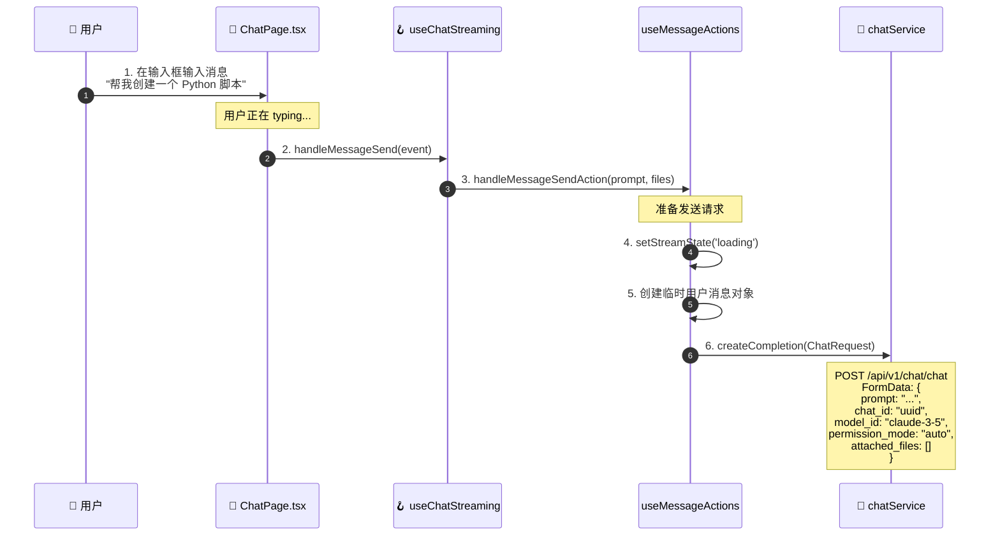
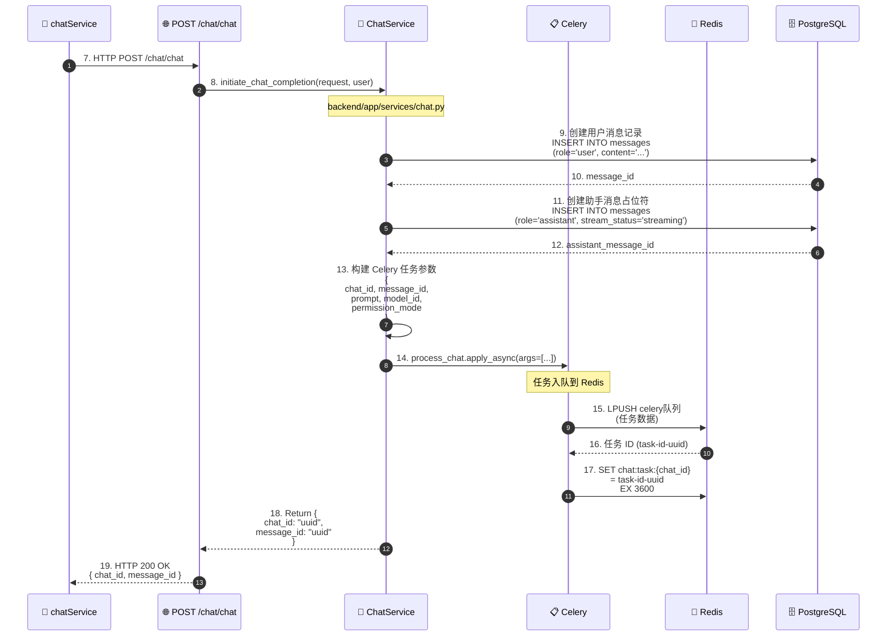
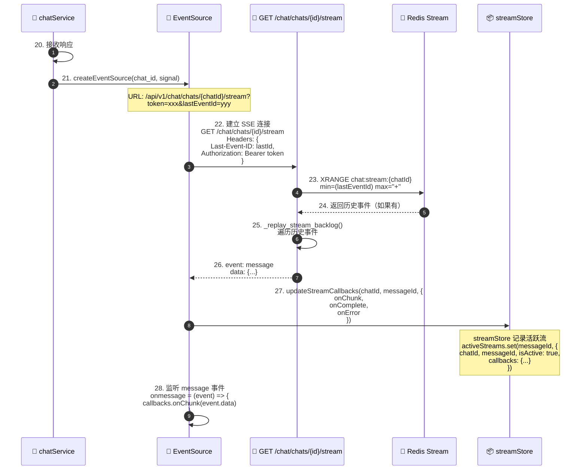
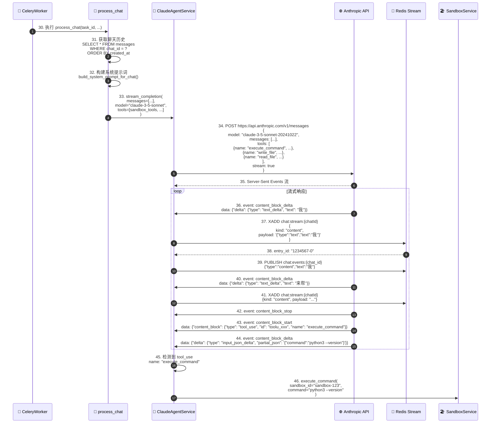
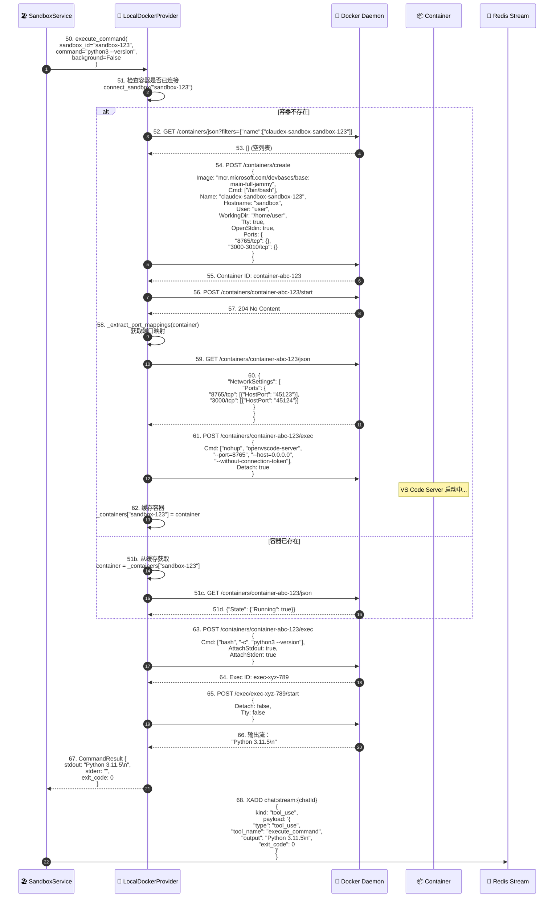
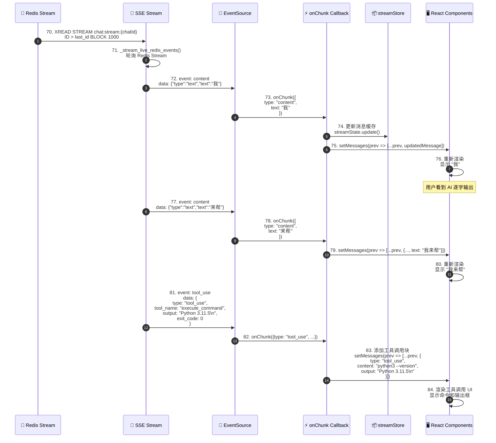
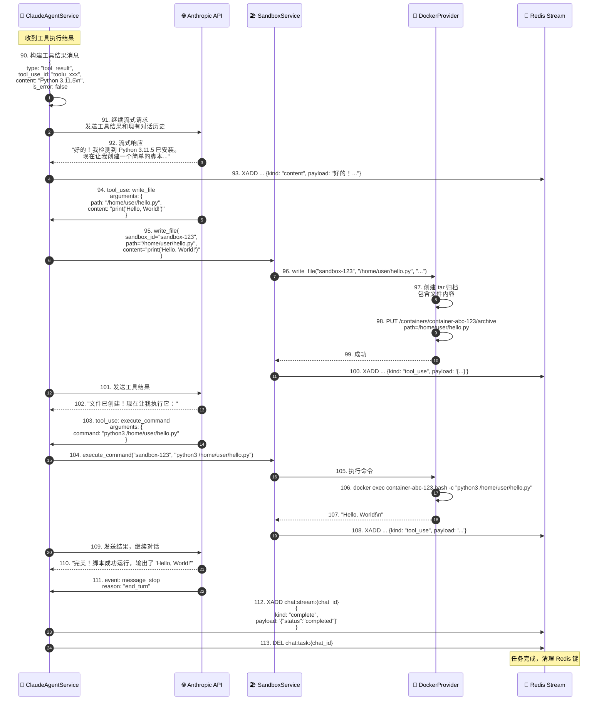
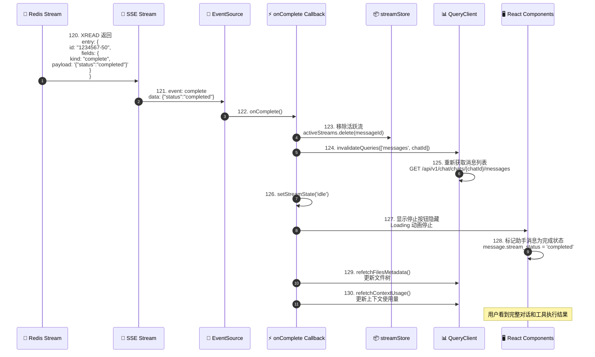
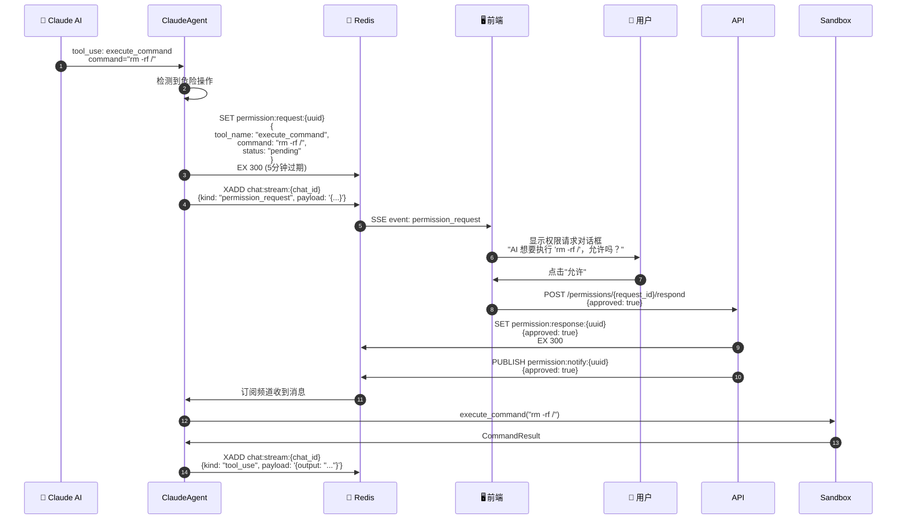

# Claudex 前端对话到 Docker 沙箱启动完整流程分析

## 📋 目录

1. [流程概述](#流程概述)
2. [详细时序图](#详细时序图)
3. [关键组件说明](#关键组件说明)
4. [数据流转路径](#数据流转路径)
5. [技术细节](#技术细节)

---

## 流程概述

本文档详细描述了用户在前端输入消息到 Docker 沙箱启动执行的完整流程，涵盖前端、后端、消息队列、缓存和容器化技术。

### 核心参与者

| 参与者 | 角色 | 技术栈 |
|--------|------|--------|
| **用户** | 发起消息请求 | 浏览器 |
| **前端** | UI 交互和流式接收 | React 19, TypeScript |
| **后端 API** | 接收请求并协调 | FastAPI, Python |
| **Celery Worker** | 异步任务处理 | Celery, Redis |
| **Claude AI** | AI 推理和决策 | Anthropic API |
| **沙箱服务** | 容器管理抽象 | SandboxService |
| **Docker 提供商** | 容器生命周期 | Docker SDK |
| **Redis** | 消息流和缓存 | Redis 7 |
| **PostgreSQL** | 数据持久化 | PostgreSQL 13 |

---

## 详细时序图

### 阶段一：用户输入与前端处理（0-100ms）



**关键代码位置：**
- 前端：`ChatPage.tsx:246` (onMessageSend)
- 前端：`useChatStreaming.ts:281` (handleMessageSend)
- 前端：`chatService.ts:17` (createCompletion)

---

### 阶段二：后端 API 接收与任务创建（100-300ms）



**关键代码位置：**
- 后端 API：`chat.py:267` (send_message endpoint)
- 后端服务：`chat.py:200` (initiate_chat_completion)
- Celery 任务：`tasks/chat_processor.py` (process_chat)

---

### 阶段三：前端连接 SSE 流（100-400ms）



**关键代码位置：**
- 前端：`chatService.ts:197` (createEventSource)
- 后端：`chat.py:448` (stream_events endpoint)
- 后端：`chat.py:179` (_create_event_stream)

---

### 阶段四：Celery 任务处理与 AI 对话（300-2000ms）



**关键代码位置：**
- Celery 任务：`tasks/chat_processor.py:50` (process_chat)
- AI 服务：`services/claude_agent.py:100` (stream_completion)
- Redis 流：`utils/redis.py` (redis_connection)

---

### 阶段五：沙箱服务处理与 Docker 容器启动（2000-3000ms）



**关键代码位置：**
- 沙箱服务：`services/sandbox.py:102` (execute_command)
- Docker 提供商：`sandbox_providers/docker_provider.py:82` (create_sandbox)
- Docker 提供商：`sandbox_providers/docker_provider.py:56` (_create_container)

---

### 阶段六：前端接收流式响应并更新 UI（持续进行）



**关键代码位置：**
- 后端：`chat.py:117` (_stream_live_redis_events)
- 前端：`useStreamCallbacks.ts:50` (onChunk)
- 前端：`useChatStreaming.ts:95` (useStreamCallbacks)

---

### 阶段七：AI 持续对话与工具调用循环（2000-10000ms）



**关键代码位置：**
- AI 服务：`services/claude_agent.py:200` (处理工具调用)
- 沙箱服务：`services/sandbox.py:120` (write_file)
- 沙箱服务：`services/sandbox.py:102` (execute_command)

---

### 阶段八：前端接收完成信号并清理（10000-10500ms）



**关键代码位置：**
- 前端：`useStreamCallbacks.ts:100` (onComplete)
- 前端：`useChatStreaming.ts:95` (useStreamCallbacks)
- 后端：`chat.py:113` (发送 complete 事件)

---

## 关键组件说明

### 1. 前端组件

#### ChatPage (`ChatPage.tsx`)
- **职责：** 主聊天页面容器
- **关键功能：**
  - 集成聊天、编辑器、终端等多个视图
  - 管理权限请求和用户问题模态框
  - 协调各个 hooks 和服务
- **关键代码：** `frontend/src/pages/ChatPage.tsx:31`

#### useChatStreaming Hook
- **职责：** 聊天流式传输的核心逻辑
- **状态管理：**
  - `streamState`: 'idle' | 'loading' | 'streaming' | 'error'
  - `currentMessageId`: 当前流式消息 ID
  - `messages`: 消息列表
- **关键方法：**
  - `sendMessage()`: 发送消息并启动流
  - `handleStop()`: 停止流式传输
  - `onChunk()`: 处理流式数据块
  - `onComplete()`: 处理完成事件
- **关键代码：** `frontend/src/hooks/useChatStreaming.ts:61`

#### chatService (`chatService.ts`)
- **职责：** 聊天 API 客户端
- **关键方法：**
  - `createCompletion()`: 发起聊天请求，返回 EventSource
  - `createEventSource()`: 创建 SSE 连接
  - `stopStream()`: 停止流式传输
- **关键代码：** `frontend/src/services/chatService.ts:17`

### 2. 后端组件

#### 聊天 API 端点 (`api/endpoints/chat.py`)
- **关键端点：**
  - `POST /chat/chat`: 发送消息并启动流
  - `GET /chat/chats/{id}/stream`: SSE 流端点
  - `DELETE /chat/chats/{id}/stream`: 取消流
  - `POST /chat/chats/{id}/restore`: 恢复到检查点
- **关键代码：**
  - `backend/app/api/endpoints/chat.py:267` (send_message)
  - `backend/app/api/endpoints/chat.py:448` (stream_events)

#### ChatService (`services/chat.py`)
- **职责：** 聊天业务逻辑核心
- **关键方法：**
  - `initiate_chat_completion()`: 启动聊天完成流程
  - `create_chat()`: 创建聊天并初始化沙箱
  - `get_chat()`: 获取聊天详情
- **沙箱初始化流程：**
  1. `sandbox_service.create_sandbox()` - 创建沙箱
  2. `sandbox_service.initialize_sandbox()` - 初始化环境（GitHub token, 环境变量等）
  3. 保存 `sandbox_id` 到 Chat 记录
- **关键代码：** `backend/app/services/chat.py:114`

#### ClaudeAgentService (`services/claude_agent.py`)
- **职责：** Claude AI 集成服务
- **关键方法：**
  - `stream_completion()`: 流式调用 Anthropic API
  - 处理工具调用（tool_use）
  - 管理对话历史和上下文
- **工具定义：**
  - `execute_command`: 在沙箱执行命令
  - `write_file`: 写入文件到沙箱
  - `read_file`: 从沙箱读取文件
  - `list_files`: 列出沙箱文件
- **关键代码：** `backend/app/services/claude_agent.py:1`

#### SandboxService (`services/sandbox.py`)
- **职责：** 沙箱管理抽象层
- **关键方法：**
  - `create_sandbox()`: 创建新沙箱
  - `execute_command()`: 执行命令
  - `write_file()`: 写文件
  - `get_files_metadata()`: 获取文件列表
  - `create_pty_session()`: 创建 PTY 会话（终端）
- **设计模式：** 策略模式 - 通过 `provider` 抽象不同沙箱实现
- **关键代码：** `backend/app/services/sandbox.py:48`

#### LocalDockerProvider (`sandbox_providers/docker_provider.py`)
- **职责：** Docker 沙箱具体实现
- **关键方法：**
  - `create_sandbox()`: 创建 Docker 容器
  - `connect_sandbox()`: 连接到现有容器
  - `execute_command()`: 通过 docker exec 执行命令
  - `write_file()`: 通过 tar archive 写文件
- **容器配置：**
  - 镜像：`mcr.microsoft.com/devbases/base:main-full-jammy`
  - 用户：`user`
  - 工作目录：`/home/user`
  - 端口：8765 (VS Code Server), 3000-3010 (Web 预览)
- **关键代码：** `backend/app/services/sandbox_providers/docker_provider.py:30`

### 3. 基础设施组件

#### Redis
- **用途：**
  - **消息流（XADD/XREAD）：** SSE 事件流
  - **Pub/Sub：** 跨节点通信
  - **任务队列：** Celery broker
  - **状态缓存：** 任务 ID、取消标志
- **关键键模式：**
  - `chat:stream:{chat_id}` - 消息流（Stream 类型）
  - `chat:task:{chat_id}` - Celery 任务 ID（String）
  - `chat:cancel:{chat_id}` - 取消通道（Pub/Sub）
  - `chat:revoked:{chat_id}` - 撤销标志（String）

#### Celery
- **用途：** 异步任务处理
- **任务：** `process_chat` - 处理聊天对话
- **配置：**
  - Broker: Redis
  - Concurrency: 25 per worker
  - Replicas: 8 (默认)
- **工作流程：**
  1. API 调用 `process_chat.apply_async()`
  2. Celery Worker 从 Redis 获取任务
  3. Worker 执行 `process_chat()` 函数
  4. 任务结果写回 Redis Stream

#### PostgreSQL
- **用途：** 持久化存储
- **关键表：**
  - `chats` - 聊天会话
  - `messages` - 消息记录
  - `users` - 用户账户
  - `user_settings` - 用户设置（沙箱提供商选择等）
  - `ai_models` - AI 模型配置

---

## 数据流转路径

### 请求路径（用户 → AI）

```
用户输入
  ↓ (React 事件)
ChatPage.tsx
  ↓ (handleMessageSend)
useChatStreaming Hook
  ↓ (sendMessage)
chatService.createCompletion()
  ↓ (HTTP POST FormData)
FastAPI: POST /api/v1/chat/chat
  ↓ (initiate_chat_completion)
ChatService.initiate_chat_completion()
  ↓ (创建消息记录)
PostgreSQL: INSERT INTO messages
  ↓ (异步任务)
Celery: process_chat.apply_async()
  ↓ (从队列获取)
Celery Worker: process_chat()
  ↓ (流式调用)
ClaudeAgentService.stream_completion()
  ↓ (HTTP SSE)
Anthropic API
  ↓ (流式响应)
ClaudeAgentService (处理 tool_use)
  ↓ (执行工具)
SandboxService.execute_command()
  ↓ (容器操作)
LocalDockerProvider.execute_command()
  ↓ (docker exec)
Docker Daemon
  ↓ (命令输出)
DockerProvider
  ↓ (CommandResult)
SandboxService
  ↓ (序列化)
Redis Stream: XADD chat:stream:{chat_id}
  ↓ (读取)
SSE: GET /chat/chats/{id}/stream
  ↓ (Server-Sent Events)
EventSource (浏览器)
  ↓ (onmessage)
onChunk Callback
  ↓ (setMessages)
React UI 更新
```

### 响应路径（AI → 用户）

```
Anthropic API (流式响应)
  ↓ (SSE 事件)
ClaudeAgentService
  ↓ (XADD)
Redis Stream
  ↓ (XREAD)
SSE Endpoint (_stream_live_redis_events)
  ↓ (EventSource.send)
EventSource (浏览器)
  ↓ (message 事件)
onChunk Callback
  ↓ (更新消息状态)
streamStore (Zustand)
  ↓ (messages 状态)
React Components (重新渲染)
  ↓ (UI 更新)
用户看到 AI 响应
```

---

## 技术细节

### 1. Server-Sent Events (SSE) 实现

**前端：**
```typescript
// chatService.ts:197
function createEventSource(chatId: string, signal?: AbortSignal): EventSource {
  const token = authService.getToken();
  const lastEventId = chatStorage.getEventId(chatId);
  const baseUrl = `${apiClient.getBaseUrl()}/chat/chats/${chatId}/stream`;

  const params = new URLSearchParams();
  params.append('token', token);
  if (lastEventId) {
    params.append('lastEventId', lastEventId); // 支持断线重连
  }

  const url = `${baseUrl}?${params.toString()}`;
  const eventSource = new EventSource(url);

  // 监听消息事件
  eventSource.onmessage = (event) => {
    const data = JSON.parse(event.data);
    // 处理流式数据
  };

  return eventSource;
}
```

**后端：**
```python
# chat.py:448
@router.get("/chats/{chat_id}/stream")
async def stream_events(
    chat_id: UUID,
    request: Request,
    current_user: User = Depends(get_current_user),
) -> EventSourceResponse:
    await _ensure_chat_access(chat_id, chat_service, current_user)

    last_event_id = request.headers.get("Last-Event-ID")

    return EventSourceResponse(
        _create_event_stream(chat_id, last_event_id),
        headers={
            "Cache-Control": "no-cache",
            "Connection": "keep-alive",
            "X-Accel-Buffering": "no",  # 禁用 Nginx 缓冲
        },
    )

# chat.py:179
async def _create_event_stream(chat_id: UUID, last_event_id: str | None):
    async with redis_connection() as redis:
        stream_name = REDIS_KEY_CHAT_STREAM.format(chat_id=chat_id)

        # 阶段1：重放积压事件（断线重连）
        async for item in _replay_stream_backlog(redis, stream_name, last_event_id):
            yield item

        # 阶段2：实时轮询新事件
        cancel_event = asyncio.Event()
        monitor_task = asyncio.create_task(
            _monitor_stream_cancellation(chat_id, cancel_event, redis)
        )

        try:
            async for event in _stream_live_redis_events(
                redis, stream_name, chat_id, last_id, cancel_event
            ):
                yield event
        finally:
            monitor_task.cancel()
```

### 2. Redis Stream 数据结构

**添加事件：**
```python
# claude_agent.py:250
await redis.xadd(
    f"chat:stream:{chat_id}",
    {
        "kind": "content",
        "payload": json.dumps({
            "type": "text",
            "text": "我"
        })
    }
)
```

**读取事件：**
```python
# chat.py:147
response = await redis.xread(
    {stream_name: last_id},
    block=1000,  # 阻塞 1 秒
    count=10,    # 每次 10 条
)
```

**事件类型：**
- `kind: "content"` - 文本内容
- `kind: "tool_use"` - 工具调用
- `kind: "error"` - 错误
- `kind: "complete"` - 完成

### 3. Docker 容器创建流程

**关键配置：**
```python
# docker_provider.py:56
def _create_container(self, sandbox_id: str):
    client = self._get_docker_client()
    container = client.containers.run(
        image="mcr.microsoft.com/devbases/base:main-full-jammy",
        command="/bin/bash",
        name=f"claudex-sandbox-{sandbox_id}",
        hostname="sandbox",
        user="user",
        working_dir="/home/user",
        stdin_open=True,   # 保持 STDIN 打开
        tty=True,          # 分配伪终端
        detach=True,       # 后台运行
        remove=False,      # 不自动删除
        network="bridge",  # 桥接网络
        ports={
            "8765/tcp": None,        # VS Code Server
            "3000-3010/tcp": None,   # Web 预览端口
        },
        environment={
            "TERM": "xterm-256color",
            "HOME": "/home/user",
            "USER": "user",
        },
    )
    return container
```

**端口映射提取：**
```python
# docker_provider.py:132
@staticmethod
def _extract_port_mappings(container) -> dict[int, int]:
    container.reload()
    ports = container.attrs.get("NetworkSettings", {}).get("Ports", {})
    port_map = {}
    for container_port, host_bindings in ports.items():
        if host_bindings and len(host_bindings) > 0:
            host_port = host_bindings[0].get("HostPort")
            internal_port = int(container_port.split("/")[0])
            port_map[internal_port] = int(host_port)
    return port_map
    # 示例: {8765: 45123, 3000: 45124, 3001: 45125, ...}
```

### 4. Celery 任务定义

**任务入口：**
```python
# tasks/chat_processor.py
@celery_app.task(bind=True)
def process_chat(self, task_id: str, ...):
    """
    异步处理聊天对话
    - 获取对话历史
    - 调用 Claude AI
    - 处理工具调用
    - 流式返回结果
    """
```

**任务调用：**
```python
# chat.py:285
result = await chat_service.initiate_chat_completion(...)
# 内部调用:
task = process_chat.apply_async(
    args=[task_id, chat_id_str, message_id_str, prompt, ...]
)

# 存储 task_id 到 Redis
await redis.setex(
    f"chat:task:{chat_id}",
    3600,  # 1 小时过期
    task.id
)
```

### 5. 权限请求流程

当 AI 需要执行敏感操作时，会触发权限请求：



### 6. 断线重连机制

**前端处理：**
```typescript
// useChatStreaming.ts:203
useStreamReconnect({
  chatId,
  fetchedMessages,
  hasFetchedMessages,
  streamState,
  currentMessageId,
  wasAborted,
  ...
});

// 内部逻辑:
// 1. 检测到 EventSource 断开
// 2. 自动重连（携带 Last-Event-ID）
// 3. 后端从该 ID 开始重放事件
// 4. 前端接收积压事件并追加到消息列表
```

**后端支持：**
```python
# chat.py:94
async def _replay_stream_backlog(redis, stream_name, min_id):
    """
    重放积压事件用于断线重连
    XRANGE 返回 [min_id, max_id] 范围内的所有事件
    """
    backlog = await redis.xrange(stream_name, min=min_id, max="+")

    for entry_id, fields in backlog:
        formatted = {
            "id": entry_id,
            "event": fields.get("kind", "content"),
            "data": fields.get("payload", ""),
        }
        yield formatted
```

### 7. 流控制（Flow Control）

**Redis Queue 溢出保护：**
```python
# utils/queue.py
async def put_with_overflow(queue: asyncio.Queue, item: str, max_size: int = 1000):
    """
    向队列添加项目，如果满了则丢弃最旧的项目
    用于 PTY 输出流控制
    """
    if queue.full():
        try:
            queue.get_nowait()  # 移除最旧的项目
        except asyncio.QueueEmpty:
            pass
    await queue.put(item)
```

**前端缓冲区：**
```typescript
// streamStore.ts
interface StreamState {
  buffers: Map<string, string>  // 每个消息的缓冲区
}
```

---

## 性能优化要点

### 1. 前端优化

- ✅ **React 19 并发特性** - 减少渲染阻塞
- ✅ **组件懒加载** - `lazy()` + `Suspense`
- ✅ **状态管理优化** - Zustand selector 避免不必要重渲染
- ✅ **请求去重** - React Query 自动缓存

### 2. 后端优化

- ✅ **异步 SQLAlchemy** - 所有数据库操作异步化
- ✅ **连接池** - 600 max_connections
- ✅ **Redis Pipeline** - 批量操作减少往返
- ✅ **Celery 并发** - 25 per worker, 8 replicas = 200 并发任务

### 3. 网络优化

- ✅ **SSE 流式传输** - 减少首字节时间（TTFB）
- ✅ **Redis Stream** - O(1) 读取，支持回放
- ✅ **断线重连** - Last-Event-ID 机制
- ✅ **跨节点同步** - Redis Pub/Sub

### 4. 容器优化

- ✅ **容器复用** - `_containers` 缓存避免重复创建
- ✅ **端口映射缓存** - `_port_mappings` 避免频繁调用 Docker API
- ✅ **异步执行** - `run_in_executor` 避免阻塞事件循环

---

## 总结

这个流程展示了 Claudex 系统如何通过多个协作组件实现从前端用户输入到 Docker 沙箱执行的完整链路：

1. **前端** 提供流畅的流式 UI 体验
2. **后端 API** 协调任务和状态管理
3. **Celery** 处理异步任务，避免阻塞
4. **Redis** 提供高性能消息流和状态缓存
5. **Docker** 提供隔离的执行环境
6. **Anthropic API** 提供 AI 推理能力

整个架构遵循了以下原则：
- **关注点分离** - 每个组件职责明确
- **异步优先** - 所有 I/O 操作异步化
- **可扩展性** - 支持水平扩展（Celery workers, API servers）
- **容错性** - 断线重连、任务重试、优雅降级

---

**文档版本：** 1.0
**最后更新：** 2025-12-31
**分析工具：** Spec Workflow MCP
