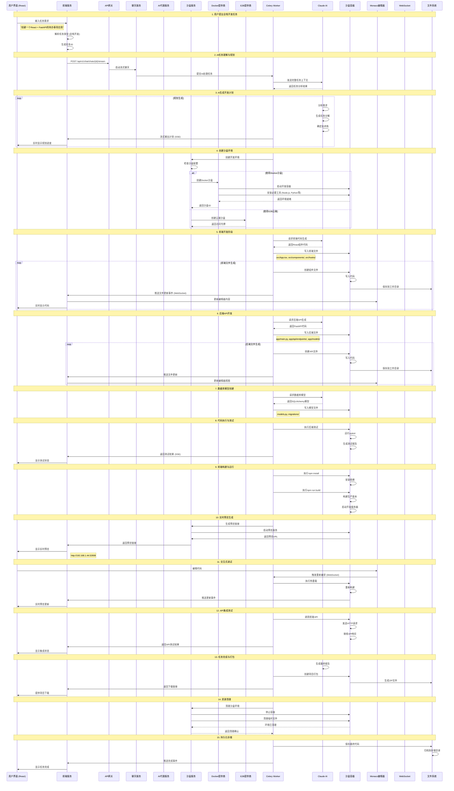
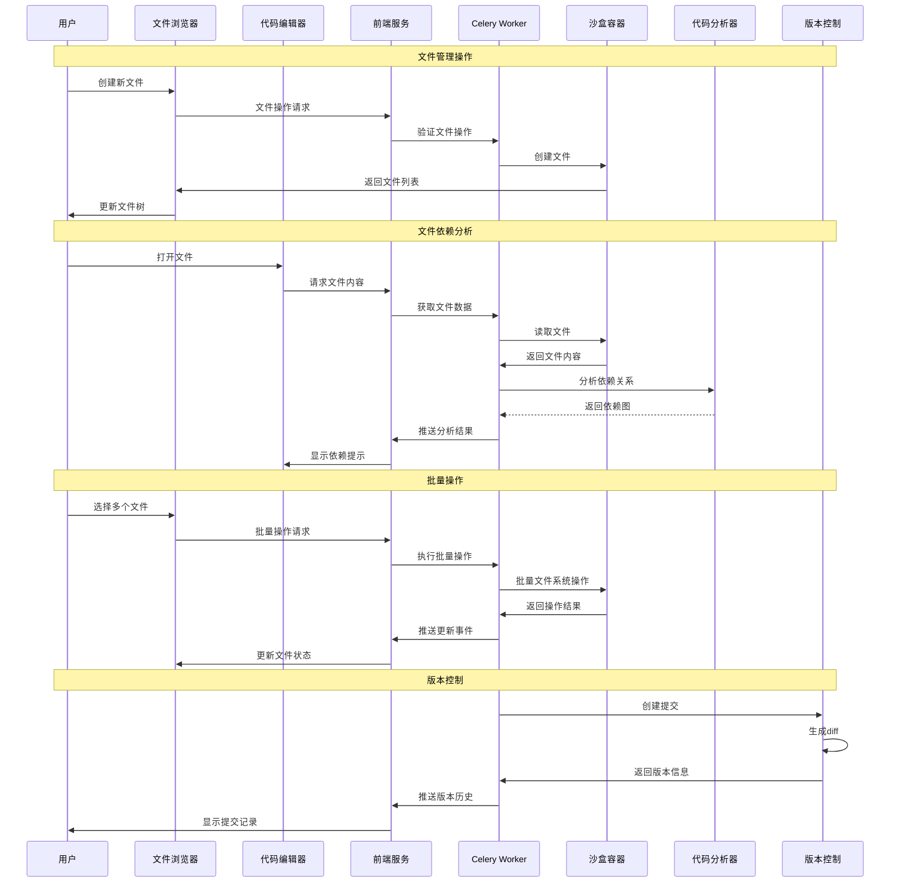
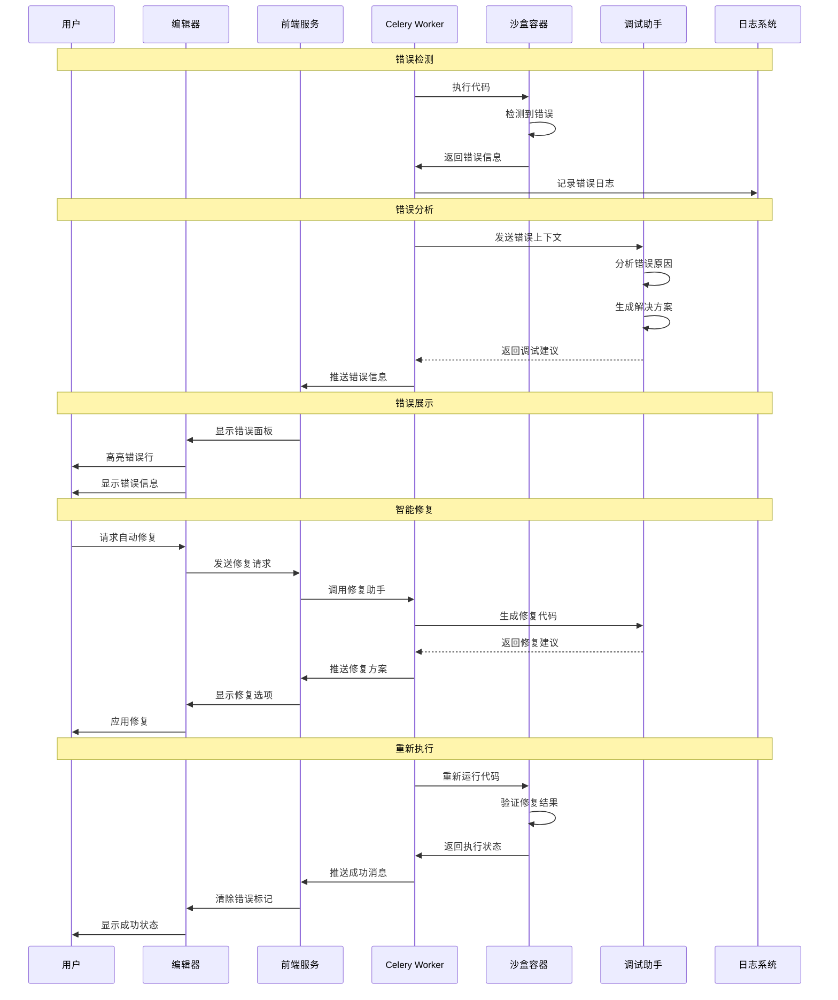
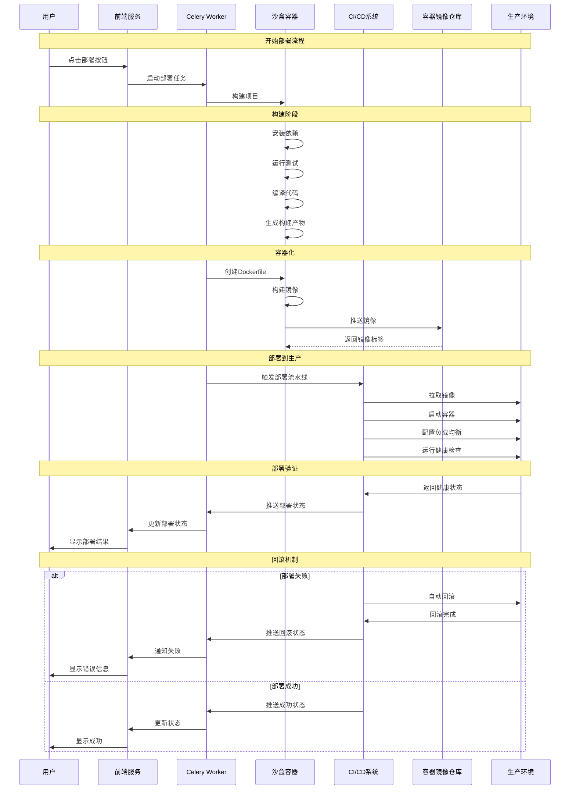
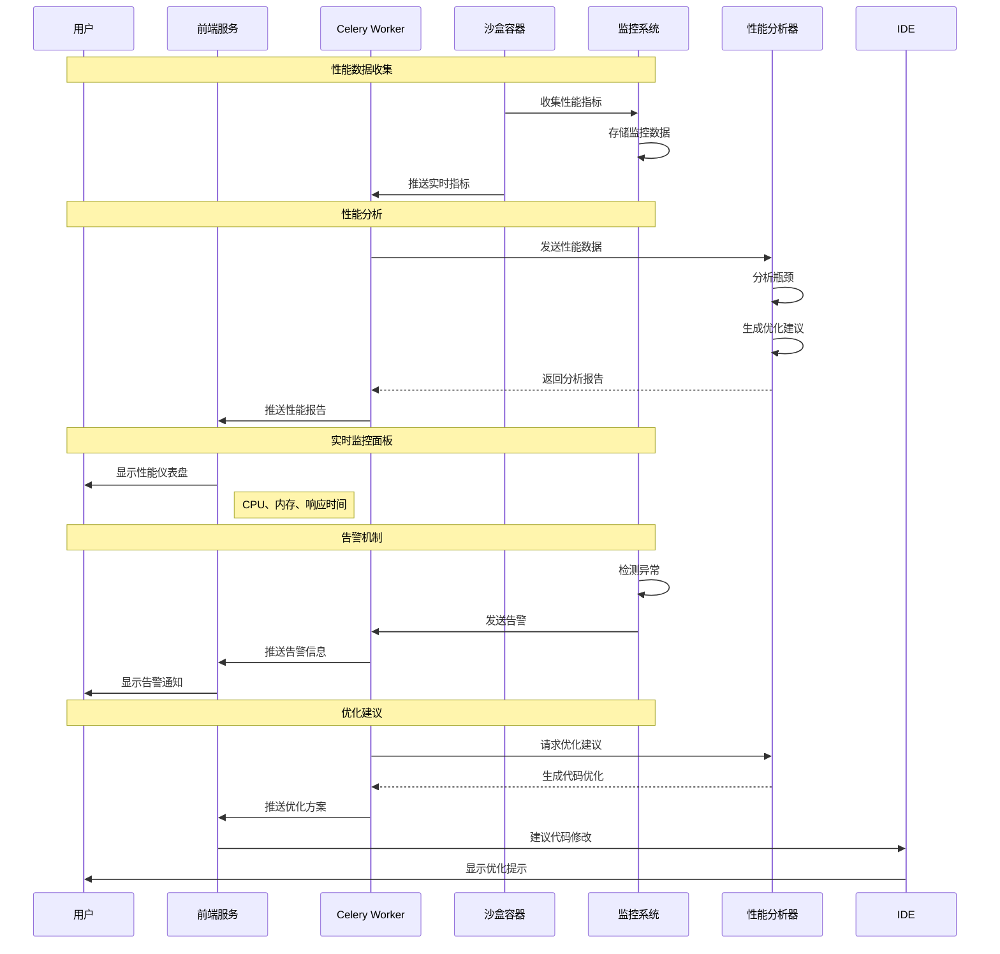

# 全栈页面任务编写时序图

## 完整的全栈开发任务流程



## 代码编辑与实时协作时序图

```mermaid
sequenceDiagram
    participant U as 用户
    participant IDE as Monaco编辑器
    participant F as 前端服务
    participant WS as WebSocket
    participant C as Celery Worker
    participant SB as 沙盒容器
    participant AI as AI助手
    participant FS as 文件系统

    Note over U, FS: 用户开始编辑代码
    U->>IDE: 输入代码
    IDE->>IDE: 语法高亮
    IDE->>IDE: 自动补全

    Note over U, FS: 实时同步到沙盒
    IDE->>F: 文件变更事件
    F->>WS: 广播文件更新
    WS->>C: 接收文件变更
    C->>SB: 写入沙盒文件系统
    SB->>FS: 更新文件

    Note over U, FS: 代码执行
    U->>IDE: 点击运行按钮
    IDE->>F: 发送执行请求
    F->>C: 触发代码执行
    C->>SB: 执行代码
    SB->>SB: 运行命令
    SB->>C: 返回执行结果

    Note over U, FS: 实时反馈
    C->>WS: 推送执行输出
    WS->>F: 广播结果
    F->>IDE: 更新输出面板
    IDE->>U: 显示执行结果

    Note over U, FS: AI辅助编程
    U->>IDE: 选择代码片段
    IDE->>F: 发送AI请求
    F->>C: 调用AI助手
    C->>AI: 生成建议
    AI--代码建议
    C>>C: 返回->>F: 推送AI建议
    F->>IDE: 显示建议
    IDE->>U: 展示AI建议
```

## 多文件项目管理时序图



## 错误处理与调试时序图



## 部署与发布时序图



## 性能监控与分析时序图



## 关键流程说明

### 1. 任务理解阶段
- AI分析用户需求
- 生成技术选型
- 分解开发任务
- 估算开发时间

### 2. 环境准备阶段
- 选择沙盒提供商
- 创建隔离环境
- 安装必要工具
- 配置开发依赖

### 3. 代码编写阶段
- 前端组件生成
- 后端API开发
- 数据库模型创建
- 业务逻辑实现

### 4. 测试验证阶段
- 单元测试执行
- 集成测试验证
- 端到端测试
- 性能测试

### 5. 部署发布阶段
- 代码构建
- 容器化
- CI/CD流水线
- 生产部署

### 6. 监控维护阶段
- 性能监控
- 错误追踪
- 日志分析
- 自动扩容

---

*全栈任务时序图生成时间: 2025-12-26 10:02:57*